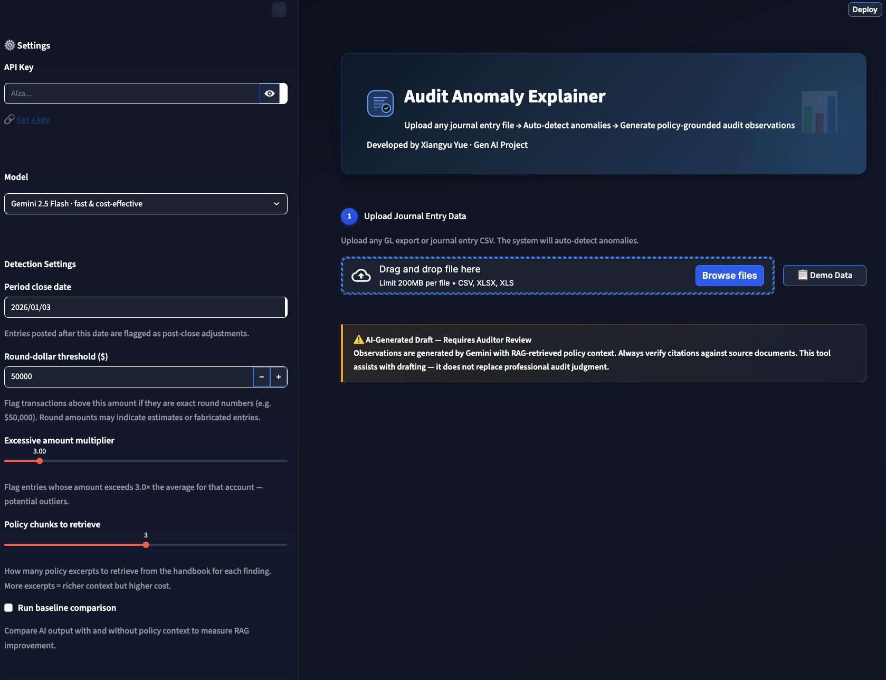
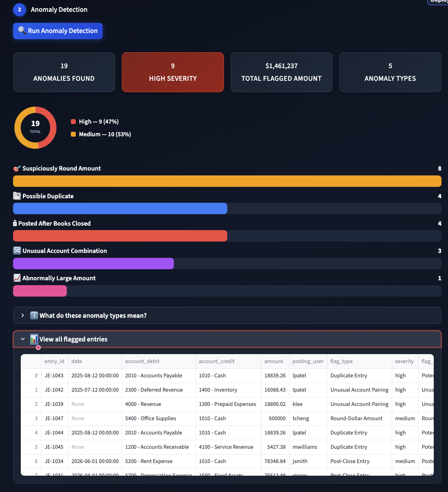
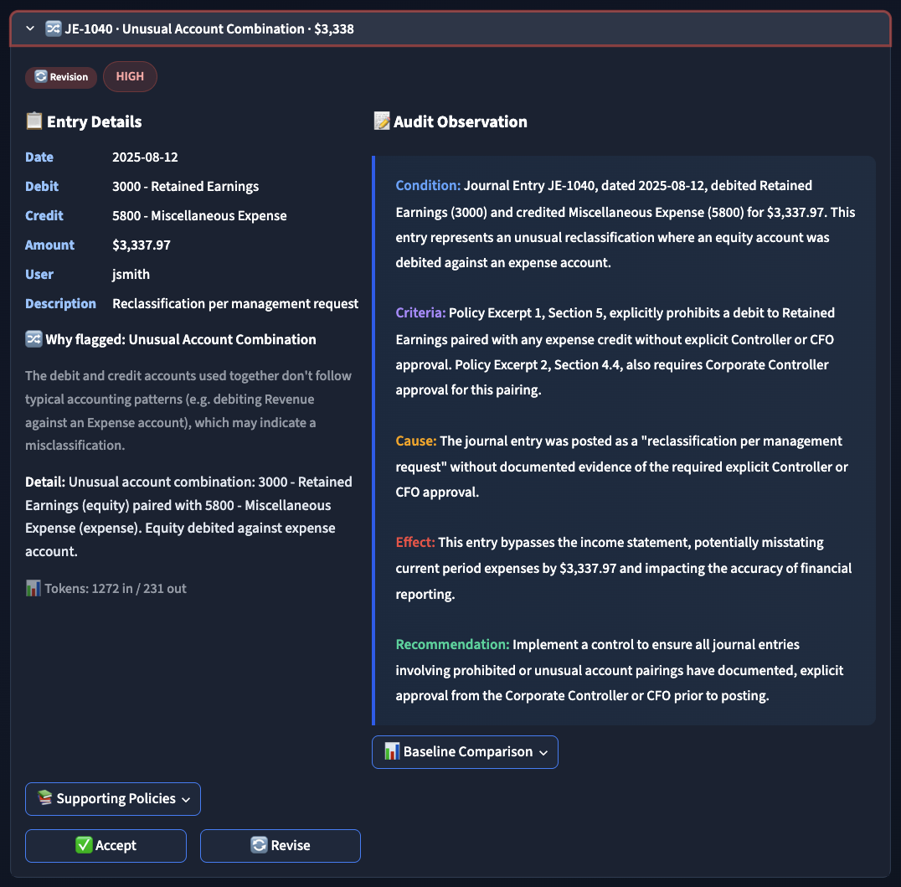
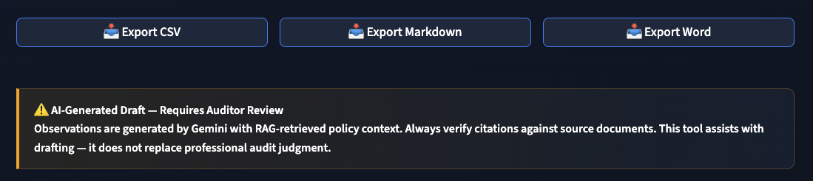

# Audit Anomaly Explainer

An AI-powered Streamlit app that helps internal auditors investigate flagged journal entry anomalies and draft structured audit observations, grounded in company accounting policies via RAG (Retrieval-Augmented Generation).

<p align="center">
  
</p>

---

## 1. Context, User, and Problem

**User:** Internal auditor performing journal entry testing during a routine compliance audit.

**Workflow being improved:** After running data-analytics procedures to flag unusual journal entries, the auditor must manually investigate each flagged item, determine whether it violates internal accounting policies, and write a formal audit observation. A single audit cycle can flag 50–200 entries; researching policies and writing up even 15–30 observations takes hours of repetitive work.

**Why it matters:** Drafting audit observations is one of the most time-consuming steps in the audit cycle. Auditors spend significant time cross-referencing flagged entries against policy documents, formatting findings into the standard five-part structure (Condition, Criteria, Cause, Effect, Recommendation), and ensuring each observation cites the correct policy. This tool automates the first draft, letting auditors focus on professional judgment rather than boilerplate writing.

**Why GenAI is useful here:** Journal entry anomalies are varied and context-dependent — a simple rule engine cannot explain *why* an entry is problematic or cite the relevant policy section. GenAI with RAG can retrieve the right policy excerpts and generate natural-language observations that follow the standard audit format, something keyword search or templates cannot do.

---

## 2. Solution and Design

### Architecture

```mermaid
flowchart LR
    A["📄 Journal Entry\nUpload\n(CSV / XLSX)"] -->|raw data| B["🔍 Anomaly\nDetector\n(5 algorithms)"]
    B -->|flagged entries\nwith severity| C["⚠️ Flagged\nAnomalies"]
    C -->|query by flag reason\n+ account info| D["📚 Policy Index\n(FAISS + Gemini\nEmbeddings)"]
    D -->|top-k policy\nchunks| E["🤖 Gemini LLM\n(with policy\ncontext)"]
    E -->|structured output| F["📝 Audit\nObservation\n(5-part format)"]

    style A fill:#1e3a5f,stroke:#60a5fa,color:#fff
    style B fill:#7c3aed,stroke:#a78bfa,color:#fff
    style C fill:#dc2626,stroke:#fca5a5,color:#fff
    style D fill:#0d9488,stroke:#5eead4,color:#fff
    style E fill:#2563eb,stroke:#93c5fd,color:#fff
    style F fill:#16a34a,stroke:#86efac,color:#fff
```



### Component Details

1. **Anomaly Detector** (`anomaly_detector.py`): Automatically scans uploaded journal entries for 5 types of anomalies:
   - Duplicate entries (same date, amount, accounts)
   - Post-close entries (posted after period close date)
   - Round-dollar amounts (exact round numbers above threshold)
   - Unusual account pairings (cross-category debits/credits)
   - Excessive amounts (outliers exceeding N× the account average)

2. **RAG Pipeline** (`rag_pipeline.py`): 5 synthetic internal accounting policy documents are chunked by section, embedded using Google `gemini-embedding-001`, and indexed in FAISS. For each flagged anomaly, the system retrieves the top-k most relevant policy chunks.

3. **LLM Client** (`llm_client.py`): Google Gemini generates structured audit observations in the standard five-part format (Condition, Criteria, Cause, Effect, Recommendation), grounded in the retrieved policy context.

4. **Streamlit App** (`app.py`): A dark-themed dashboard with a 4-step workflow:
   - **Step 1:** Upload journal entries (CSV/XLSX) or use demo data
   - **Step 2:** Run anomaly detection with configurable thresholds, view severity breakdown (donut chart) and type distribution (bar chart)
   - **Step 3:** Generate AI-powered audit observations with RAG-retrieved policy context
   - **Step 4:** Review observations with color-coded sections, accept/revise each finding, and export to CSV, Markdown, or Word (DOCX)

### Key Design Choices

- **RAG over policies** ensures observations cite the correct internal policy section rather than hallucinating generic standards.
- **Structured output format** (Condition/Criteria/Cause/Effect/Recommendation) matches the standard audit observation format used in practice (IIA Standards).
- **Low temperature (0.3)** for consistent, professional output across observations.
- **Automatic anomaly detection** removes the need for a separate analytics tool — the app handles the full pipeline from raw journal entries to final observations.
- **Baseline comparison mode** lets users compare RAG-augmented output against prompt-only output to see the value RAG adds.
- **Completeness check** automatically warns when an observation is missing any of the five required sections.
- **Chart of Accounts upload** allows accurate account classification for any company's GL structure.

---

## 3. Evaluation and Results

### Baseline

The baseline is a **prompt-only approach** where the same Gemini model generates observations *without* any policy context. This isolates the value that RAG adds over a generic LLM response.

The app includes a built-in baseline comparison toggle (sidebar checkbox: "Run baseline comparison") that generates both RAG and no-RAG observations side by side for direct comparison.

### Test Cases

20 synthetic anomalies across 5 types, crafted based on standard audit testing scenarios:

| Anomaly Type | Count | Severity Mix |
|---|---|---|
| Round-Dollar Amount | 8 | 7 medium, 1 high |
| Duplicate Entry | 4 | 4 high |
| Post-Close Entry | 4 | 4 medium |
| Unusual Account Pairing | 3 | 3 high |
| Excessive Amount | 1 | 1 high |

### Evaluation Rubric (Model-as-Judge)

Run the automated evaluation:
```bash
python evaluate.py --google-key <your-key>
```

The evaluation scores each observation on 4 dimensions (1–4 scale):

| Dimension | What it measures |
|---|---|
| Policy Citation | Does the observation cite the correct policy number and section? |
| Condition Accuracy | Does the Condition section accurately state the key facts? |
| Reasoning Quality | Are the Cause and Effect sections logical and specific? |
| Recommendation Quality | Is the Recommendation actionable and appropriate? |

### What Worked

- **Policy citation accuracy:** RAG-augmented observations consistently cite the correct policy document and section number. Baseline observations either cite generic standards (e.g., "GAAP") or fabricate policy numbers.
- **Specificity:** RAG observations reference specific thresholds from the policy (e.g., "$60,000 single-entry threshold for Consulting Expense") rather than vague statements.
- **Misclassification detection:** The system correctly identifies entries posted to the wrong account (e.g., consulting services charged to Salaries Expense) by cross-referencing policy guidelines.
- **Completeness:** With retry logic and increased token limits, observations reliably include all 5 required sections.

### Where It Broke Down

- **Gemini free-tier rate limiting:** The free tier aggressively throttles requests, causing truncated observations (20–50 tokens instead of 200+). The app includes retry logic with backoff, but heavy usage may still hit limits. A paid API key is recommended for processing more than a few entries.
- **Weak retrieval on novel anomalies:** When an anomaly doesn't clearly match any policy in the knowledge base, retrieval scores are low and the observation falls back to generic language.
- **Multi-flag entries:** Entries flagged for multiple reasons (e.g., "Excessive Amount | Round-Dollar Amount") sometimes get observations that focus on only one issue.
- **No fraud detection:** The system flags statistical anomalies but cannot assess intent, materiality, or fraud risk — these require professional judgment.

### Where a Human Should Stay Involved

- Assessing whether an anomaly represents a genuine error vs. a legitimate business transaction
- Evaluating materiality and fraud risk
- Verifying that cited policies are current and applicable
- Making final accept/reject decisions on each observation
- All observations are clearly marked as "AI-Generated Draft — Requires Auditor Review"

---

## 4. Artifact Snapshot

### Main Dashboard — Anomaly Detection Results
The app displays severity metrics, a donut chart (high vs. medium), and a bar chart breaking down anomaly types.

<p align="center">
  
</p>

### Observation Detail — Color-Coded Audit Findings
Each observation shows color-coded section headings, entry details, plain-language flag explanations, and supporting policy excerpts with relevance scores.

<p align="center">
  
</p>

### Export Options
Results can be exported as CSV, Markdown, or Word DOCX.

<p align="center">
  
</p>

### Sample Output

**Input:** JE-1042 — $16,088.43 debit to Deferred Revenue (2300), credit to Inventory (1400), description "Adjustment entry - see supporting memo"

**Generated Observation:**
> **Condition:** Journal Entry JE-1042, dated 2025-07-12, for $16,088.43, debited Deferred Revenue (2300) and credited Inventory (1400). This represents an unusual pairing of a liability account with a non-cash asset account.
>
> **Criteria:** Policy Section 4.5, "Cross-Category Entries Without Clear Business Purpose," requires entries pairing accounts from non-adjacent categories to have a clear, documented business reason.
>
> **Cause:** Supporting documentation (memo) was not readily available for review.
>
> **Effect:** Without proper documentation, the validity of the $16,088.43 entry cannot be substantiated.
>
> **Recommendation:** Ensure all journal entries involving unusual account pairings have complete supporting documentation attached.

---

## Setup and Usage

### Prerequisites
- Python 3.10+
- A Google API key with Gemini API access ([Get one here](https://aistudio.google.com/apikey))

### Installation

```bash
git clone https://github.com/andyyueqq/audit-anomaly-explainer.git
cd audit-anomaly-explainer
pip install -r requirements.txt
```

### Configuration

Copy the example env file and add your key:
```bash
cp .env.example .env
# Edit .env and set GOOGLE_API_KEY=AIza...
```

Or enter the key directly in the app's sidebar.

### Run the App

```bash
streamlit run app.py
```

If `streamlit` is not on your PATH:
```bash
python -m streamlit run app.py
```

Then:
1. Enter your Google API key in the sidebar
2. Upload a journal entry file (CSV or Excel) or click **Demo Data**
3. Click **Run Anomaly Detection** — review the flagged entries and severity breakdown
4. Select anomaly types or specific entries, then click **Generate All**
5. Review each observation, click Accept or Revise
6. Export results as CSV, Markdown, or Word

### Supported Input Formats

The app auto-detects column names. Common formats:

| Column | Aliases accepted |
|---|---|
| `entry_id` | `je_number`, `entryno`, `doc_no`, `transaction_id` |
| `date` | `posting_date`, `je_date`, `transaction_date` |
| `account_debit` | `debit_account`, `account_key` (paired-line format) |
| `account_credit` | `credit_account` |
| `amount` | `debit_amount`, `credit_amount` |
| `posting_user` | `entered_by`, `created_by`, `preparer` |
| `description` | `memo`, `details`, `narration` |

Paired-line format (EntryNo 1.1/1.2 with separate debit/credit rows) is automatically detected and converted.

### Run Evaluation

```bash
python evaluate.py --google-key <your-key>
```

Results are saved to `evaluation_results.json`.

---

## Project Structure

```
audit-anomaly-explainer/
├── app.py                  # Streamlit web app (dark-themed, 4-step workflow)
├── anomaly_detector.py     # 5 anomaly detection algorithms + COA parser
├── rag_pipeline.py         # Chunking, embedding (Gemini), FAISS indexing, retrieval
├── llm_client.py           # Gemini API client for observation generation
├── evaluate.py             # RAG vs baseline evaluation with model-as-judge
├── generate_anomalies.py   # Synthetic test data generator
├── policies/               # Internal accounting policy documents (RAG knowledge base)
│   ├── journal_entry_approval.md
│   ├── period_end_close.md
│   ├── expense_thresholds.md
│   ├── duplicate_entry_prevention.md
│   └── account_usage_guidelines.md
├── data/
│   ├── full_journal.csv        # 50-entry demo journal (includes normal + anomalous)
│   └── flagged_anomalies.csv   # 20 pre-flagged anomalies for evaluation
├── requirements.txt
├── .env.example
└── .gitignore
```

## Limitations

- **Drafts only:** All generated observations require auditor review before use in any audit report.
- **Policy coverage:** The system can only cite policies in its knowledge base. Anomalies involving uncovered areas will produce generic citations.
- **Rate limiting:** Gemini free-tier rate limits may cause truncated observations. The app retries automatically, but a paid API key is recommended for production use.
- **No judgment replacement:** The system cannot assess materiality, fraud risk, or management intent — these require professional judgment.

---

*Developed by Xiangyu Yue · GenAI Course Final Project*
